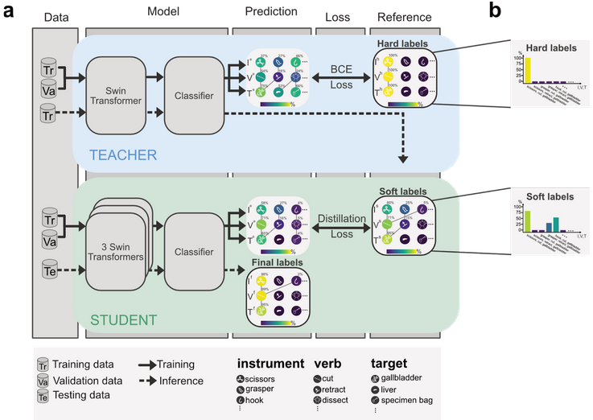

# Self-distillation for surgical action recognition

This repo serves as reproduction code for the paper "Self-Distillation for Surgical Action Recognition" see, [ArXiV](https://arxiv.org/abs/2303.12915) to be published at MICCAI 2023.



<!-- <p align="center">
  
</p> -->

The "Self-Distilled-Swin" project presents a Swin Transformer model trained through self-distillation. This approach is specifically designed to address challenges related to high number of classes, class imbalance and label ambiguity. The repository contains the implementation of this method applied to the CholecT45 dataset, as utilized in the CholecTriplet2022 challenge. The primary objective is to predict surgical action triplets: Instrument, Verb, and Target categories.

# 1- Environment set up

* First, clone the repository and create a new environment:
```
conda create -n sdswin python=3.7.0
```
* Next, cd to the repo folder and install the requirements.txt file
```
pip install -r requirements.txt
```


# 2- Dataset
### **CholecT45:** 
You can request the dataset access [in the CholecT45 dataset's repository](https://github.com/CAMMA-public/cholect45).


After downloading the dataset, you'll need to adapt the `parent_path` and `output_dir` parameter in `config.yaml` with the path to the dataset in your local machine. For example:

```
parent_path: PATH/CholecT45
output_dir:  path where to save the outputs
```


### **Cholec80:** (Phase annotations)
The surgical phase annotations are parsed from cholec80 dataset, you can download the dataset following the instructions in the [cholec80 dataset's repository](https://github.com/CAMMA-public/TF-Cholec80).

After downloading the dataset, set the path to the phase annotations folder `cholec80_phase_path` in the config.yaml

```
cholec80_phase_path: local_path/cholec80/phase_annotations
```

### **Annotations:** 
The dataloader expects the annotations in a csv format, in order to generate the annotations csv file, run the following command.

```
python parse.py
```

If you have cholec80 and want to parse the phase annotations as well add phase=true

```
python parse.py phase=true
    
```


Once the CholecT45.csv file is generated, the final CholecT45 folder structure should be as following:
- CholecT45
  - data
    - VID01
    - VID02
    - ...
  - dict
  - instrument
  - target
  - triplet
  - verb
  - dataframes
    - CholecT45.csv


# 3- Pretrained models
We provide a selection of pretrained models for public use. We have made available six pretrained models listed below:
```
pretrained_models=('SwinT' 'SwinT+MultiT' 'SwinT+SelfDv2' 'SwinT+MultiT+SelfD' '+phase' 'SwinLarge')
```

You can run and evaluate all the pretrained models on the CholecT45 dataset using the command
```bash
bash run_pretrained_models.sh
```

To run a specific model, use the following command with the model name from the list above

```python
python generate.py inference=true pretrained_model=true save_folder=official_results exp=model_name_from_the_list
```
Results will be saved at `output_dir/official_results`

# 4- Reproduce the paper experiments


You can use the following parameters to run all the experiments described in the paper: `target_size`, `model_name`, and `exp`.

**Note:** Variations in model training due to hardware setup may impact soft-labels generation and quality. Ideally, the teacher model should converge in the initial epochs; however, if not, it's advisable to stop teacher training using the `save_epoch` parameter for optimal results.

### Train SwinT and SwinT+SelfD Experiments:
```bash
bash runs/run.sh target_size=100 save_epoch=3 exp=SwinT

```
### Train SwinT+MulTi and SwinT+Multi+SelfD
```bash
bash runs/run.sh target_size=131 save_epoch=3 exp=SwinT+MultiT
```
### Train Multi+Phase
```bash
bash runs/run.sh target_size=138 save_epoch=3 exp=MultiT+phase
```
### Train SwinLarge
```bash
bash runs/run.sh model_name=swin_large_patch4_window7_224 target_size=131 save_epoch=3 exp=SwinLarge
```


# 5- Inference
To use saved checkpoints for inference, set `inference=true`
```python
python generate.py inference=true target_size=100 exp=SwinT
```

Ensure all five folds' checkpoints are available at `output_dir/checkpoints`. The predictions will be saved in `output_dir/predictions` folder.


# 6- Evaluation
Final predictions are saved either in the `output_dir/oofs` folder after training or the `output_dir/predictions` folder if generated during inference. To evaluate training predictions, set `inference=false`:


```python
python evaluate.py inference=false
```
To evaluate inference predictions, set `inference=true`
```python
python evaluate.py inference=true
```
All saved experiments in the respective folder will be evaluated.

If testing the ensemble of multiple experiments, set `ensemble=true` add the relative path to those predictions in a list `ensemble_models=[prediction1.csv,prediction2.csv,...]`


# Cite via BibTex:

```
@inproceedings{yamlahi2023self,
title={Self-distillation for surgical action recognition},
author={Yamlahi, Amine and Tran, Thuy Nuong and Godau, Patrick and Schellenberg, Melanie and Michael, Dominik and Smidt, Finn-Henri and N{"o}lke, Jan-Hinrich and Adler, Tim J and Tizabi, Minu Dietlinde and Nwoye, Chinedu Innocent and others},
booktitle={International Conference on Medical Image Computing and Computer-Assisted Intervention},
pages={637--646},
year={2023},
organization={Springer}
}
```