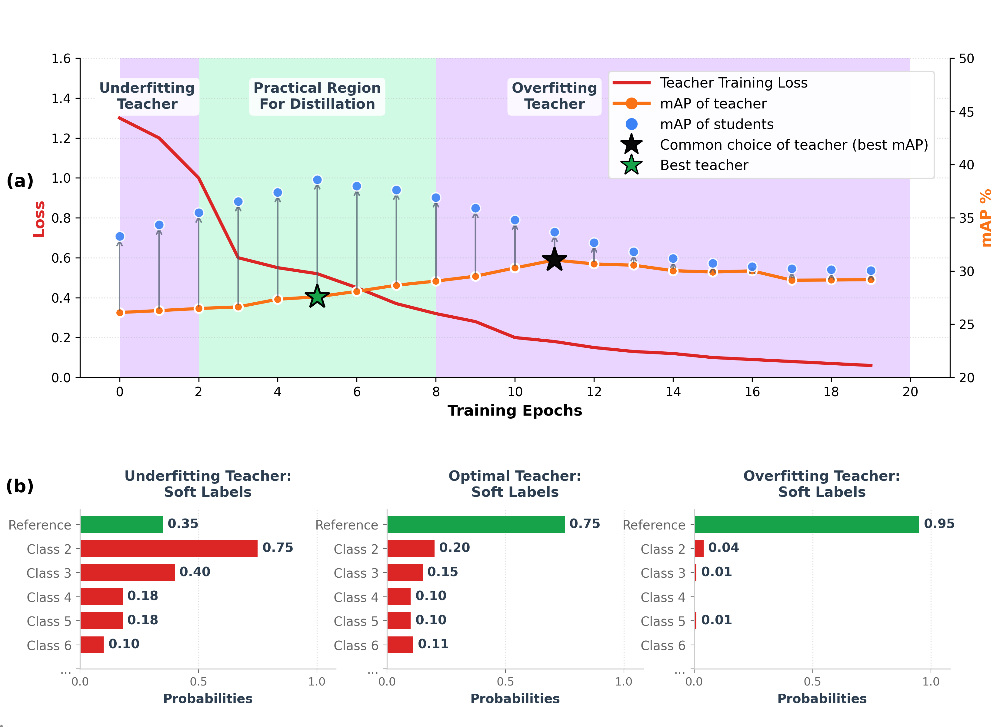

# Smarter Self-Distillation: Optimizing the Teacher for Surgical Video Applications

This repository provides reproduction code for the following research papers:

- **[Self-Distillation for Surgical Action Recognition](https://arxiv.org/abs/2303.12915)**  
  Presented at *MICCAI 2023*.  
  - To reproduce the results from this paper, please refer to the repository tag: `miccai23`.  
  - Additional documentation is available in [readme_miccai23.md](readme_miccai23.md).

- **[Smarter Self-Distillation: Optimizing the Teacher for Surgical Video Applications](https://papers.miccai.org/miccai-2025/paper/1323_paper.pdf)**  
  Published at *MICCAI 2025*. See the [preprint](https://papers.miccai.org/miccai-2025/paper/1323_paper.pdf) for details.

---

## What's New in the MICCAI 2025 Release

The MICCAI 2025 implementation improves self-distillation performance by optimizing the teacher model, overcoming the limitations of our previous self-distillation method (MICCAI 2023 work), which relied on a sub-optimal teacher without teacher selection. 

This release introduces two key improvements:

- **Teacher Selection** – automatically identifies the most effective teacher model (checkpoint) for distillation.  
- **Multi-Teacher Ensemble** – leverages multiple teachers to enhance the quality of soft labels.  

  

---

## Code Availability

The code for the *MICCAI 2025* paper will be released shortly after the conference.  

---

## Reproducing MICCAI 2023 Results

To reproduce the experiments from **Self-Distillation for Surgical Action Recognition (MICCAI 2023)**:

- Switch to the repository tag: `miccai23`  
- Refer to the documentation in [readme_miccai23.md](readme_miccai23.md)  

---
